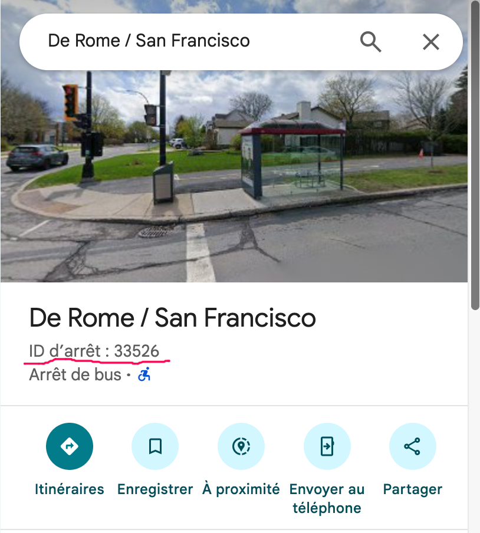

# richie256/rtl-schedule

[](https://github.com/richie256/rtl-schedule/actions/workflows/dockerimage.yml)

This project provides an application to get bus schedule information from the Réseau de transport de Longueuil (RTL). The application can run in two different modes:

1.  **HTTP Mode:** A web service to get the next bus for a given stop.
2.  **MQTT Mode:** An MQTT publisher that periodically fetches the next bus time and publishes it to an MQTT broker.

## Prerequisite

- A bus stop code number.
- Docker.

## How to find a Stop Code

To get a stop code, open Google Maps and locate a bus stop in an RTL-served location. Click on the bus stop, and you will find the stop id in the information panel.




## Supported Architectures

This image supports multiple architectures such as `x86-64` and `arm64`. The Docker build process should retrieve the correct image for your architecture.

## Usage

This project can be run using Docker. First, build the Docker image, then run it in the desired mode.

### 1. Build the Docker Image

To build the Docker image locally, run the following command in the root of the project:

```bash
docker build -t rtl-schedule .
```

### 2. Run the Container

You can run the container in either HTTP or MQTT mode.

#### HTTP Mode

To run the container in HTTP mode, which provides a web service to get the next bus schedule, use the following command:

```bash
docker run -p 8080:80 -v ./data:/data -e MODE=http rtl-schedule
```

-   **Port:** The service is available on port `8080` of the host machine.
-   **Endpoint:** `GET /rtl_schedule/nextstop/<STOP_CODE>`

**Example using curl:**

```bash
curl http://localhost:8080/rtl_schedule/nextstop/12345
```

#### MQTT Mode

To run the container in MQTT mode, which publishes the bus schedule to an MQTT broker, you need to provide environment variables. Create a `.env` file with the following content:

```
STOP_CODE=your_stop_code
MQTT_HOST=your_mqtt_broker_host
MQTT_PORT=1883
MQTT_USERNAME=your_mqtt_username
MQTT_PASSWORD=your_mqtt_password
MQTT_USE_TLS=false
HASS_DISCOVERY_ENABLED=false
HASS_DISCOVERY_PREFIX=homeassistant
MQTT_REFRESH_TOPIC=rtl/schedule/refresh
```

Then run the container with the following command:

```bash
docker run --env-file .env -v ./data:/data -e MODE=mqtt rtl-schedule
```

-   **Topic:** `home/schedule/bus_stop`
-   **Interval:**
    -   Every 10 seconds during rush hours (weekdays 6:00-9:00 and 15:00-18:00).
    -   Every 60 seconds at all other times.
-   **Payload:** The message payload is a JSON object containing schedule information.

#### MQTT Refresh Action

This application supports a refresh action via MQTT. When a message is published to the `MQTT_REFRESH_TOPIC` (by default, `rtl/schedule/refresh`), the application will immediately publish the latest bus schedule. After that, it will switch to a high-frequency update mode, publishing every 5 seconds for the next 10 minutes. The payload of the refresh message is ignored.

This is useful if you want to get an immediate update on the bus schedule without waiting for the next scheduled publication.

## Unit Tests

To run the unit tests, execute the following command:

```bash
python -m pytest
```

## Tagging and Release

This project uses semantic versioning for releases. To create a new release, you need to create and push a git tag.

1.  **Create a tag:**
    To create an annotated tag (which is recommended), use:
    ```bash
    git tag -a v1.0.0 -m "Version 1.0.0"
    ```
    Replace `v1.0.0` with your desired tag and the message with a relevant description.

2.  **Push the tag:**
    To push a single tag to your remote repository (usually named `origin`), use:
    ```bash
    git push origin v1.0.0
    ```

    Alternatively, you can push all of your local tags at once:
    ```bash
    git push --tags
    ```
Pushing a new tag will trigger the GitHub Actions workflow to build and publish a new Docker image with the corresponding version.

## Local Development

If you want to run the application without Docker, you can install the dependencies from `requirements.txt` and run the application directly in the desired mode.

**Install dependencies:**

```bash
pip install -r requirements.txt
```

**Run in HTTP mode:**

```bash
export MODE=http
python app.py
```

**Run in MQTT mode:**

```bash
export MODE=mqtt
export STOP_CODE=your_stop_code
export MQTT_HOST=your_mqtt_broker_host
python app.py
```
