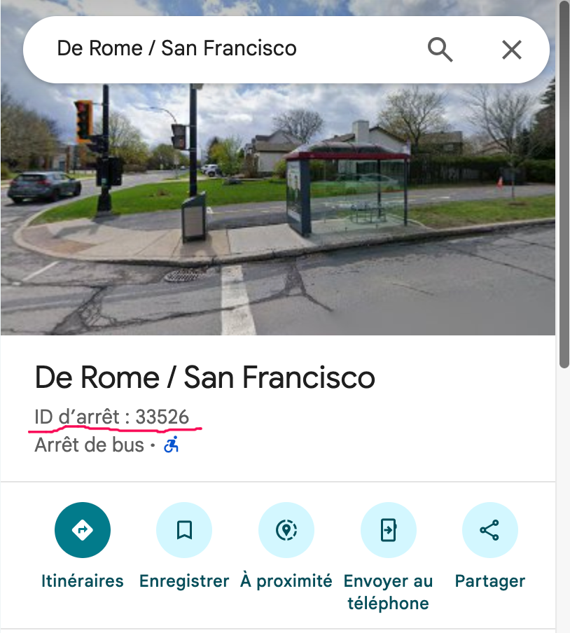

# :bus: transit-schedule

[](https://github.com/richie256/transit-schedule/actions/workflows/dockerimage.yml)
[](https://github.com/richie256/transit-schedule/actions/workflows/tests.yml)
[](https://codecov.io/gh/richie256/transit-schedule)

[](https://github.com/richie256/transit-schedule/releases)

A bus schedule provider for the Greater Montréal area, designed for self-hosted home automation setups.

Supported transit agencies:
- **RTL** — Réseau de transport de Longueuil :oncoming_bus:
- **STM** — Société de transport de Montréal :metro:
- **STL** — Société de transport de Laval :bus:

The application runs in two modes:

| Mode | Description |
|---|---|
| **HTTP** :globe_with_meridians: | REST API — query the next bus for any stop on demand |
| **MQTT** :satellite: | Publishes the next departure time to an MQTT broker on a recurring schedule, ideal for Home Assistant |

---

## :round_pushpin: How to Find a Stop Code

Every stop has a public **stop code** — a short number you can find directly in Google Maps. Open Maps, click on any bus stop marker in your transit agency's coverage area, and the stop code appears in the info panel on the left.



---

## :hammer_and_wrench: Quick Start

### HTTP Mode :globe_with_meridians:

```bash
docker run -p 8080:80 -v ./data:/data \
  -e MODE=http \
  -e TRANSIT=STM \
  ghcr.io/richie256/transit-schedule:latest
```

Query the next bus at any stop:

```bash
curl http://localhost:8080/transit-schedule/nextstop/52611
```

### MQTT Mode :satellite:

Create a `.env` file (see [`.env.example`](.env.example) for all options):

```env
TRANSIT=RTL
STOP_CODE=31592
MQTT_HOST=your_mqtt_broker_host
MQTT_PORT=1883
MQTT_USERNAME=your_username
MQTT_PASSWORD=your_password
```

Then run the container:

```bash
docker run --env-file .env -v ./data:/data \
  -e MODE=mqtt \
  ghcr.io/richie256/transit-schedule:latest
```

---

## :gear: Configuration Reference

| Environment Variable | Description | Default |
| --- | --- | --- |
| `TRANSIT` | Transit agency: `RTL`, `STM`, or `STL` | `RTL` |
| `MODE` | Run mode: `http` or `mqtt` | `http` |
| `STOP_CODE` | Public stop code — required for MQTT mode unless `STOPS_CONFIG` is set | None |
| `STOPS_CONFIG` | JSON array for monitoring multiple stops simultaneously (see below) | None |
| `TARGET_ROUTE` | Filter results to a specific route ID (e.g. `44`) | None |
| `TARGET_DIRECTION` | Filter results by trip headsign (e.g. `Direction Terminus Panama`) | `Direction Terminus Panama` (RTL only) |
| `RETRIEVAL_METHOD` | Data source strategy: `live` or `gtfs` | `live` for RTL, `gtfs` for STM/STL |
| `FLARESOLVERR_URL` | URL of a [FlareSolverr](https://github.com/FlareSolverr/FlareSolverr) instance — required to download RTL GTFS data (see below) | None |
| `FORCE_CACHE_REFRESH` | Set to `true` to clear and rebuild the live scraper cache on startup | `false` |
| `LANGUAGE` | Output language: `en` or `fr` | `fr` |
| `TZ` | Timezone | `America/Montreal` |
| `MQTT_HOST` | MQTT broker hostname or IP | None |
| `MQTT_PORT` | MQTT broker port | `1883` |
| `MQTT_USERNAME` | MQTT username | None |
| `MQTT_PASSWORD` | MQTT password | None |
| `MQTT_USE_TLS` | Enable TLS for the MQTT connection | `false` |
| `HASS_DISCOVERY_ENABLED` | Enable Home Assistant MQTT auto-discovery | `false` |
| `HASS_DISCOVERY_PREFIX` | Home Assistant discovery prefix | `homeassistant` |

---

## :closed_lock_with_key: RTL & Cloudflare — FlareSolverr Required for GTFS Mode

The RTL GTFS feed at `rtl-longueuil.qc.ca` is protected by **Cloudflare bot protection**, which blocks all automated HTTP requests — even with a browser User-Agent. Depending on your chosen retrieval method:

| Mode | FlareSolverr required? | How it works |
|---|---|---|
| `RETRIEVAL_METHOD=live` *(default for RTL)* | ❌ No | Fetches live schedules directly from the RTL Hastus API. No GTFS download needed. |
| `RETRIEVAL_METHOD=gtfs` | ✅ **Yes** | Must download the GTFS zip. Without FlareSolverr, RTL returns HTTP 403 and the app cannot start. |

### How FlareSolverr works

[FlareSolverr](https://github.com/FlareSolverr/FlareSolverr) is a small proxy server that launches a real Chrome browser internally to solve Cloudflare's JavaScript challenge. Once solved, it returns the valid `cf_clearance` cookies to transit-schedule, which uses them to download the zip file directly. **No shared volumes are required** — communication is pure HTTP between containers.

### Docker Compose example (RTL GTFS mode)

```yaml
services:
  transit-schedule:
    image: ghcr.io/richie256/transit-schedule:latest
    environment:
      - TRANSIT=RTL
      - RETRIEVAL_METHOD=gtfs
      - FLARESOLVERR_URL=http://flaresolverr:8191
      - STOP_CODE=31592
      - MQTT_HOST=your_mqtt_broker_host
    volumes:
      - ./data:/data
    networks:
      - transit-net

  flaresolverr:
    image: ghcr.io/flaresolverr/flaresolverr:latest
    networks:
      - transit-net

networks:
  transit-net:
```

> **Tip:** If FlareSolverr is already running elsewhere on your server, simply set `FLARESOLVERR_URL=http://<host>:<port>` and ensure both containers are on the same Docker network.

---

## :mag: Filtering

Two filters can be combined to narrow results to exactly the bus you care about:

1. **`TARGET_ROUTE`** — Matches the route ID exactly. Strongly recommended when your stop is served by routes with similar numbers (e.g. `14` vs `144`).
2. **`TARGET_DIRECTION`** — Matches against the trip headsign. For RTL, defaults to `Direction Terminus Panama`.

When both are set, a departure must satisfy **both** conditions to be returned.

---

## :busstop: Multiple Stops (MQTT mode)

Use `STOPS_CONFIG` to monitor several stops or routes at once. This overrides `STOP_CODE`, `TARGET_ROUTE`, and `TARGET_DIRECTION`.

```bash
STOPS_CONFIG='[
  {"stop_code": "31592", "route_id": "14", "direction": "Terminus Longueuil"},
  {"stop_code": "32752", "route_id": "44", "direction": "Terminus Panama"}
]'
```

Each entry publishes to its own MQTT topic and creates a separate Home Assistant sensor:
- `home/transit/<transit>/stop_<stop_code>_<route_id>` (or `stop_<stop_code>` if no route_id)

---

## :bar_chart: Data Sources

| Agency | Source | Notes |
|---|---|---|
| RTL | http://www.rtl-longueuil.qc.ca/transit/latestfeed/RTL.zip | ⚠️ Cloudflare protected — [FlareSolverr required](#closed_lock_with_key-rtl--cloudflare--flaresolverr-required-for-gtfs-mode) for GTFS mode |
| RTL | Hastus API (`madprep_i.rtl-longueuil.qc.ca`) | Used in `live` mode — no download required |
| STM | https://www.stm.info/sites/default/files/gtfs/gtfs_stm.zip | No Cloudflare protection |
| STL | https://www.stlaval.ca/datas/opendata/GTF_STL.zip | No Cloudflare protection |

---

## :test_tube: Running Tests

```bash
python3 -m pytest tests/
```
